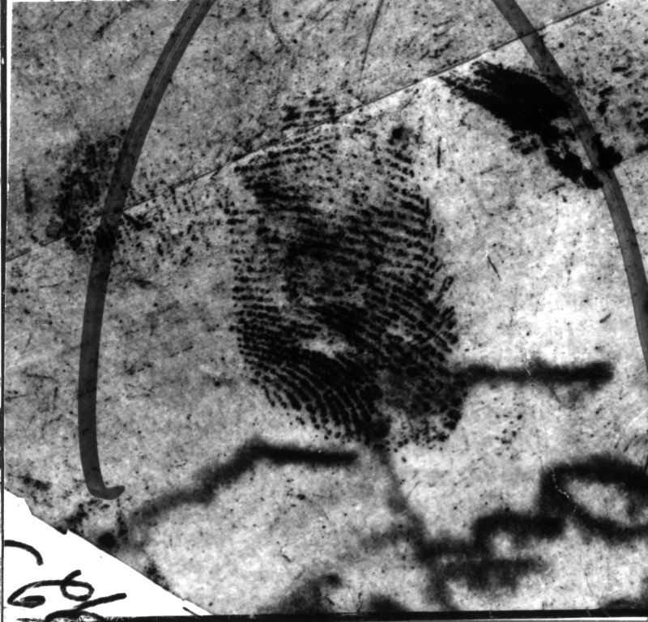
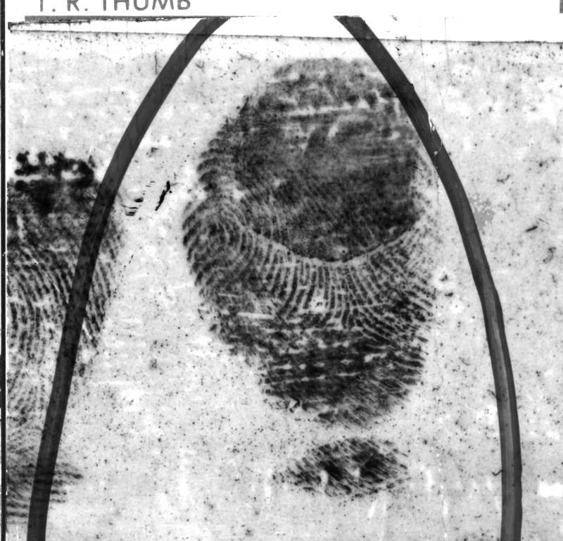
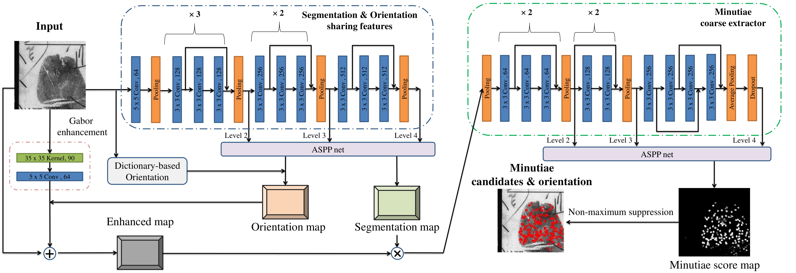

# Robust Minutiae Extractor: Integrating Deep Networks and Fingerprint Domain Knowledge

By Dinh-Luan Nguyen, Kai Cao and Anil K.Jain


<div align="middle">
    
    
</div>

For precise fingerprint segmentation, let's refer to this paper: [Automatic Latent Fingerprint Segmentation](https://arxiv.org/pdf/1804.09650.pdf)
### Introduction
We present the framework called **MinutiaeNet** including CoarseNet and FineNet


**CoarseNet** is a residual learning based convolutional neural network that takes a fingerprint image as initial input, and the corresponding enhanced image, segmentation map, and orientation field (computed by the early stages of CoarseNet) as secondary input to generate the minutiae score map. The minutiae orientation is also estimated by comparing with the fingerprint orientation.



**FineNet** is a robust inception-resnet based minutiae classifier. It processes each candidate patch, a square region whose center is the candidate minutiae point, to refine the minutiae score map and approximate minutiae orientation by regression. Final minutiae are the classification results.

We refer reader to read [FineNet_architecture.pdf](assets/FineNet_architecture.pdf) for more details of FineNet.

The repository includes:
* Source code of Minutiae Net which includes CoarseNet and FineNet.
* Training code for FineNet and CoarseNet
* Pre-trained weights for FineNet and CoarseNet
* Jupyter notebooks to visualize the minutiae detection pipeline at every step


### License

MinutiaeNet is released under the MIT License.

### Citing

If you find MinutiaeNet useful in your research, please citing:

    @inproceedings{Nguyen_MinutiaeNet,
	author    = {Dinh-Luan Nguyen and Kai Cao and Anil K. Jain},
	title     = {Robust Minutiae Extractor: Integrating Deep Networks and Fingerprint Domain Knowledge},
	booktitle = {The 11th International Conference on Biometrics, 2018},
	year      = {2018},
	}


### Contents
1. [Requirements: software](#requirements-software)
2. [Installation](#installation)
3. [Demo](#demo)
4. [Usage](#usage)

# Requirements: software
`Python 2.7`, `Tensorflow 1.7.0`, `Keras 2.1.6`.

# Installation
To make life easier, I suggest to use Anaconda for easy installation. Version using pip is similar.
  ```Shell
  conda install cv2, numpy, scipy, matplotlib, pydot, graphviz
  ```
Download models and put into `Models` folder.
- **CoarseNet**: [Googledrive](https://drive.google.com/file/d/1alvw_kAyY4sxdzAkGABQR7waux-rgJKm/view?usp=sharing)    ||    [Dropbox](https://www.dropbox.com/s/gppil4wybdjcihy/CoarseNet.h5?dl=0)
- **FineNet**: [Googledrive](https://drive.google.com/file/d/1wdGZKNNDAyN-fajjVKJoiyDtXAvl-4zq/view?usp=sharing)    ||    [Dropbox](https://www.dropbox.com/s/k7q2vs9255jf2dh/FineNet.h5?dl=0)


# Demo
To help understanding MinutiaeNet, there are 2 notebooks for you to play around:
 - Understanding CoarseNet: [demo_CoarseNet.ipynb](Demo_notebooks/demo_CoarseNet.ipynb)
 - Understanding FineNet: [demo_FineNet.ipynb](Demo_notebooks/demo_FineNet.ipynb)
 - MinutiaeNet - a combination of CoarseNet and FineNet: set `isHavingFineNet = False` in CoarsetNet if you want to fuse results from CoarseNet and FineNet
 
# Usage
 - **FineNet**
* [demo_FineNet.ipynb](Demo_notebooks/demo_FineNet.ipynb) is useful if you want to integrate into existing minutiae dectection framework/SDKs. It shows an example of using a pre-trained model to verify the detection in your own images.
* [train_FineNet.ipynb](Demo_notebooks/train_FineNet.ipynb) shows how to train FineNet on your own dataset. 


 - **CoarseNet**
* [demo_CoarseNet.ipynb](Demo_notebooks/demo_CoarseNet.ipynb) can be called to generate minutiae as well as masks and orientation.
* [train_CoarseNet.ipynb](Demo_notebooks/train_CoarseNet.ipynb) shows how to train CoarseNet on your own dataset. 

Python files which can run directly from command line are also provided.
Note that models as well as architectures here are slightly different from the paper because of the continuing development of this project
